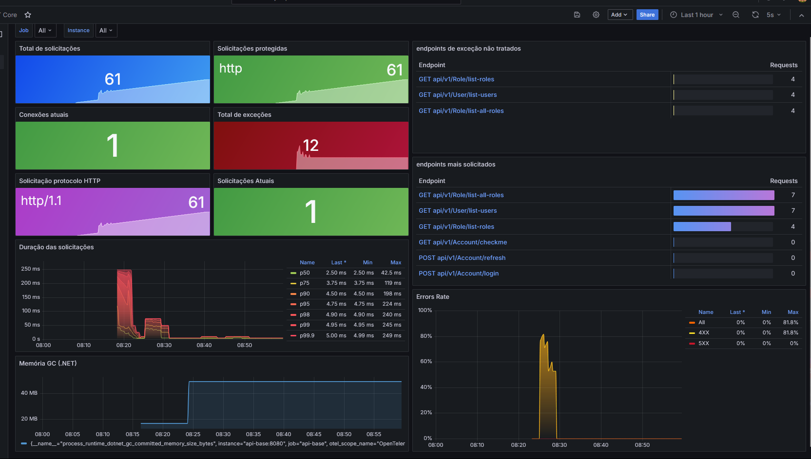

# Visão geral do projeto

Esse ambiente junta **duas aplicações principais** com uma stack simples de observabilidade para facilitar desenvolvimento, testes e análise de comportamento da aplicação.

## Repositórios

- **API (.NET / backend):** https://github.com/mt-amaral/api-base
- **App (frontend):** https://github.com/mt-amaral/app-base

### 1. Observabilidade

A stack de observabilidade foi montada para acompanhar métricas, logs e traces.

Composta por:

- **Prometheus** → coleta métricas da API em `/metrics`
- **Grafana** → Visualização dos dashboards e consultas
- **Tempo** → recebe e armazena traces via OTLP
- **Loki** → recebe e armazena logs
- **OpenTelemetry Collector** → recebe telemetria da aplicação e encaminha:
  - **traces** para o Tempo
  - **logs** para o Loki

---

# Fluxo

## Fluxo de observabilidade

**api-base → Prometheus / OpenTelemetry Collector → Grafana**

Na prática fica assim:

### Métricas

- a API expõe métricas
- o Prometheus coleta essas métricas
- o Grafana consulta o Prometheus para montar os painéis

### Logs e traces

- a aplicação envia telemetria para o OpenTelemetry Collector
- o Collector encaminha:
  - **traces** para o Tempo
  - **logs** para o Loki
- o Grafana lê esses dados e permite visualizar tudo em dashboard

---

```text
api-base
   ├── /metrics → Prometheus → Grafana
   ├── traces   → OTel Collector → Tempo → Grafana
   └── logs     → OTel Collector → Loki  → Grafana
```

---

# Serviços do ambiente

Pelo `docker-compose.prod.yml`, o ambiente tem estes serviços: `app-base`, `api-base`, `postgres`, `prometheus`, `grafana`, `tempo`, `loki` e `otel-collector`. Todos sobem na mesma rede `observability-network`.

## Portas principais

- **5002** → frontend (`app-base`)
- **5000** → API (`api-base`)
- **5432** → PostgreSQL
- **9090** → Prometheus
- **3000** → Grafana
- **3200** → Tempo
- **3100** → Loki
- **4317 / 4318** → OpenTelemetry Collector (OTLP gRPC / HTTP)

---

# deploy do ambiente

## Ambiente completo com observabilidade

```bash
docker compose -f docker-compose.prod.yml up --build -d
```

## Ambiente mais simples

Se a ideia for subir só aplicação + banco, existe também um compose mais enxuto com:

- `app-base`
- `api-base`
- `postgres`

```
docker compose -f docker-compose.yml up --build -d
```

---

# Resultado final
o modelo .json do dashbaord esté com o arquivo `modelo-dashboard-grafana.json`

